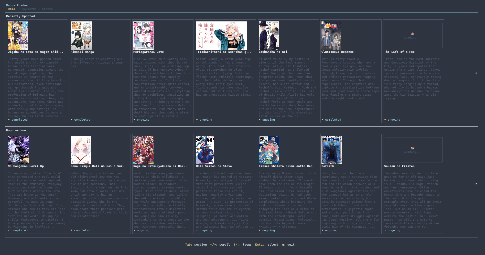
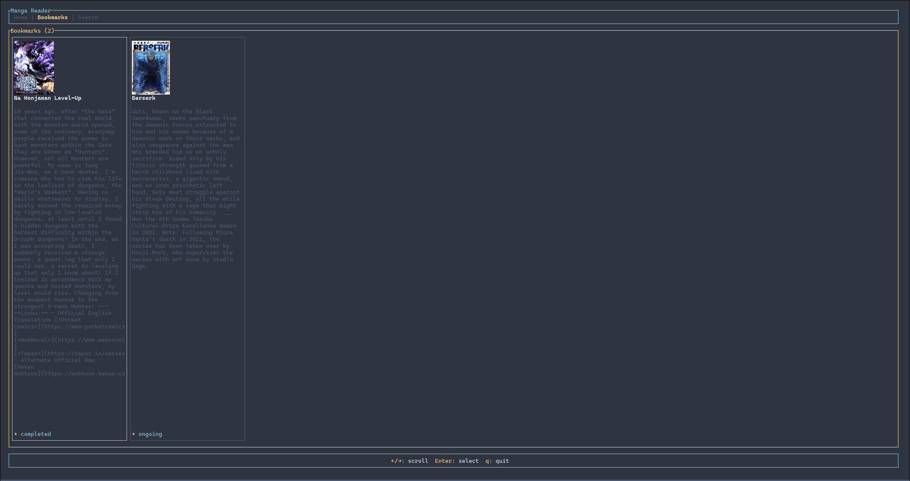

# Tachiyomi-TUI

A modern Terminal User Interface (TUI) for browsing and reading manga from MangaDex, built with Rust and Ratatui.

## Features

- **Browse**: Explore recently updated and popular manga.
- **Read**: Integrated manga reader with page-by-page navigation.
- **Visuals**: Full support for manga covers and page images directly in the terminal.
- **Performance**: Asynchronous data fetching and image loading for a smooth experience.

## Screenshots

<p align="center">
  
  
  
</p>

## Demo

https://github.com/nebyu08/Tachiyomi-TUI/raw/main/src/images/output.mp4

## Technology Stack

- **[Ratatui](https://ratatui.rs/)**: TUI framework for the interface.
- **[Tokio](https://tokio.rs/)**: Asynchronous runtime.
- **[Reqwest](https://github.com/seanmonstar/reqwest)**: HTTP client for API interaction.
- **[Ratatui-image](https://github.com/extrawurst/ratatui-image)**: Image rendering in the terminal.
- **[MangaDex API](https://api.mangadex.org/)**: Source for manga data and images.

## Getting Started

### Prerequisites

- Rust (latest stable version)
- A terminal with image support (e.g., Kitty, WezTerm, or iTerm2)

### Installation & Run

```bash
# Clone the repository
git clone https://github.com/nebyu08/Tachiyomi-TUI.git
cd Tachiyomi-TUI

# Run the application
cargo run --release
```

## Keybindings

### Global
- `q`: Quit the application
- `Esc`: Go back to the previous view

### Home / Navigation
- `Tab` / `Down`: Cycle focus (Header -> Recent -> Popular)
- `Up`: Cycle focus backwards
- `Left` / `Right`: Scroll through manga lists or switch tabs (Home, Bookmarks, Search)
- `Enter`: Select manga or chapter

### Reader
- `Left`: Previous page
- `Right`: Next page
- `n`: Next chapter
- `p`: Previous chapter

## License

MIT

## Credits

This project uses the [MangaDex API](https://api.mangadex.org/) to fetch manga data and images. Thanks to the MangaDex team for providing a free and open API for the manga community.
